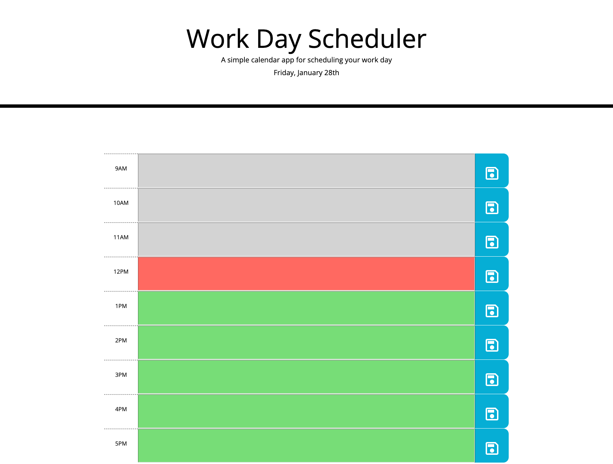

# Work Day Scheduler

## Description
A simple calendar application that allows a user to save events for each color-coded hour of the day.

## License

  
This project is licensed under the MIT License.

For more information on this license, please visit [their website](https://www.mit.edu/~amini/LICENSE.md).

## Deployment
[Deployment Link](https://yyb613.github.io/work-day-scheduler)

## Contact
If you have any questions, you can find me [here](https://yyb613.github.io/portfolio).
